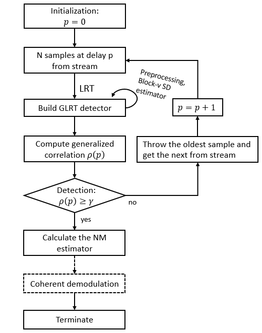
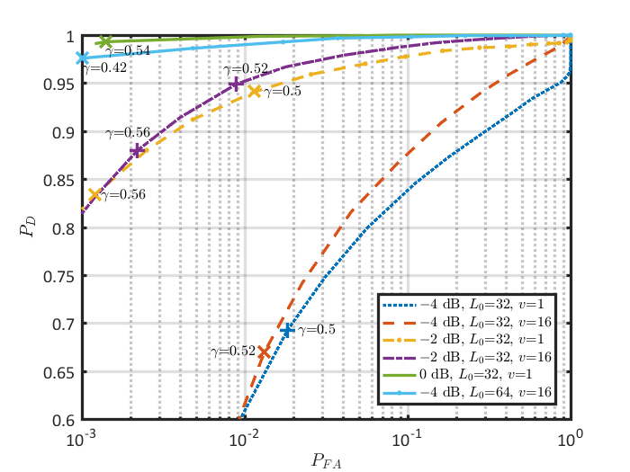
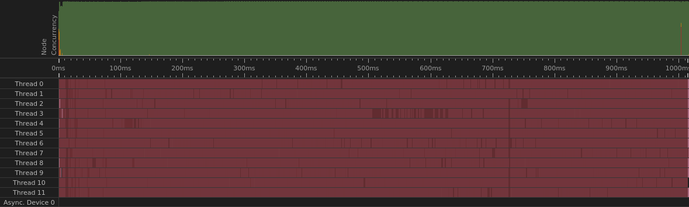

# Joint Detection and Synchronization for LPI/LPD Communications

Companion code for the paper:

> H. Zhai, B.-P. Paris, "Practical Methods for Joint Time and Carrier Synchronization in LPI/LPD Communications," *IEEE MILCOM*, 2022.

LPI/LPD communication systems operate at very low SNR and rely on coherent processing, which requires precise time, frequency, and phase synchronization at the receiver. This repository contains the data-aided joint frame and carrier synchronization algorithms from the paper — a sequential GLRT-based detector for an embedded preamble, low-complexity coarse carrier estimation performed during detection, and fine joint estimation after detection — together with the MATLAB simulations that produce the paper's figures and a real-time C++ implementation of the receiver.



## Repository layout

| Directory | Contents |
|---|---|
| [`main_matlab/`](main_matlab/) | MATLAB simulation of the detector and estimators; `main_submit_figure_1..4.m` generate the data for each figure in the paper, and the matching `*_plot.m` scripts render them. Includes the GLRT sequential detector, the proposed joint estimators, classical baselines (Fitz and Kay frequency estimators), and theoretical bound comparisons. |
| [`SDR_main/`](SDR_main/) | Real-time C++17 implementation of the receiver as a TBB flow graph — burst-mode detection, joint time/phase/frequency estimation, and correction. Reads streams live samples from a USRP / GNU Radio flowgraph over ZeroMQ. |
| [`paper_3_10/`](paper_3_10/) | LaTeX source of the paper. |
| [`slides/`](slides/) | LaTeX source of the MILCOM presentation. |
| [`main_matlab_figures/`](main_matlab_figures/) | Generated figures: ROC curves, estimator accuracy vs. bounds, partial-preamble detection behavior, and real-time throughput/latency measurements. |

## Simulation results

Detection performance is characterized by ROC curves, and estimator accuracy is compared against classical estimators and theoretical bounds across SNR:



To reproduce a figure from the paper, run the corresponding pair of scripts in MATLAB, e.g.:

```matlab
main_submit_figure_2        % generate data
main_submit_figure_2_plot   % render the figure
```

## Real-time implementation

The receiver in [`SDR_main/`](SDR_main/) implements the same algorithms as a real-time, multi-threaded pipeline using the TBB flow graph, with FFTW for spectral processing and ZeroMQ for sample transport from the SDR front end. Throughput and latency were profiled with Intel's Flow Graph Analyzer:



Build:

```bash
g++ -std=c++17 main.cpp \
    -I$TBB_INCLUDE -L$TBB_LIBRARY_RELEASE -Wl,-rpath,$TBB_LIBRARY_RELEASE -ltbb \
    -I$HOME/fftw3/include -L$HOME/fftw3/lib -lfftw3 \
    -I$HOME/libzmq/include -lzmq \
    -O3 -o main
```

Dependencies: [oneTBB](https://github.com/uxlfoundation/oneTBB), [FFTW3](https://www.fftw.org/), [ZeroMQ](https://zeromq.org/) (cppzmq).

## Citation

```bibtex
@inproceedings{zhai2022joint,
  author    = {Zhai, Haotian and Paris, Bernd-Peter},
  title     = {Practical Methods for Joint Time and Carrier Synchronization
               in {LPI/LPD} Communications},
  booktitle = {Proc. IEEE Military Communications Conference (MILCOM)},
  year      = {2022}
}
```

## Author

**Haotian Zhai** — Ph.D. in Electrical and Computer Engineering, George Mason University
📧 hzhai26@outlook.com
